# CS336 Lecture 3 学习讲义

> 副标题：现代大语言模型架构、超参数与稳定训练经验
>
> 适用对象：正在上 CS336 的课程同学
>
> 依据材料：[2025 Lecture 3 - architecture.pdf](/home/tfx/rust_projects/cs336/lecture/2025%20Lecture%203%20-%20architecture.pdf)

---

## 目录

1. 这节课在讲什么
2. 从标准 Transformer 到现代 LM：哪些东西变了，哪些没变
3. 归一化与残差路径：为什么现代模型几乎都用 pre-norm
4. LayerNorm、RMSNorm 与去 bias：现代块结构的主流选择
5. FFN 与激活函数：为什么 SwiGLU 成了近年的默认答案
6. Serial block 与 parallel block：块内并行到底值不值得
7. 位置编码全景图：从绝对位置到相对位置
8. RoPE：现代 LLM 最常见的位置编码
9. 超参数经验：`d_ff`、head dim、深宽比例、词表大小
10. 正则化与稳定训练：dropout、weight decay、z-loss、QK norm
11. 注意力推理优化：KV cache、MQA、GQA、滑动窗口注意力
12. 如果今天自己做一个现代 LM，默认怎么选
13. 高频考点与常见误区
14. 附：最小代码实现片段
15. 一句话总结构图

---

## 1. 这节课在讲什么

`lecture2` 主要回答的是：

- 训练一个模型需要哪些底层 primitive
- 怎么算内存
- 怎么算 FLOPs
- 怎么把训练循环跑起来

而 `lecture3` 回答的是另一个非常关键的问题：

> 现代大语言模型在“架构设计”和“训练细节”上，究竟形成了哪些共识？

这节课不是在教你再背一遍标准 Transformer，而是在做更接近研究与工程实践的事情：

- 哪些架构选择几乎已经成为默认答案
- 哪些超参数其实没有那么敏感
- 哪些训练 trick 对稳定性和效率确实重要
- 哪些变体主要是为了推理成本，而不是训练精度

原 slide 的主题可以压缩成一句话：

> 不要只会实现一个“课本 Transformer”，还要知道现代 LLM 通常为什么长成今天这个样子。

---

## 2. 从标准 Transformer 到现代 LM：哪些东西变了，哪些没变

讲义首先回顾了“原始 Transformer”与课程作业里“现代简化版”之间的区别。

标准 Transformer 常见设定：

- 位置编码：正弦余弦
- FFN 激活：ReLU
- 归一化：post-norm LayerNorm
- 线性层常带 bias

而课程实现的现代化简版更接近近年大模型习惯：

- pre-norm
- RoPE
- SwiGLU
- 大量线性层和 norm 层不带 bias

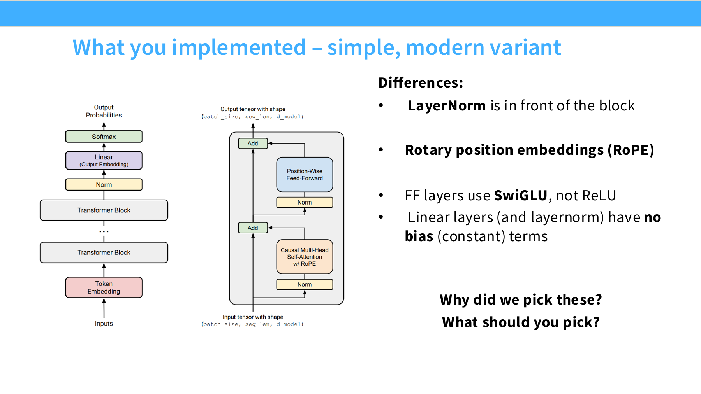

这张图对应的核心问题其实不是“我们为什么这样实现作业”，而是：

- 这些改动是不是已经构成现代 LLM 的共识
- 如果你今天重新设计一个 dense decoder-only LM，你的默认起点应该是什么

这节课给出的总体判断是：

- 大体骨架仍然是 Transformer
- 但很多局部组件已经朝 “LLaMA-like” 方向收敛
- 真正变化最频繁的地方，通常是 position embedding、FFN 设计、attention 推理优化和稳定性 trick

---

## 3. 归一化与残差路径：为什么现代模型几乎都用 pre-norm

### 3.1 pre-norm vs post-norm 是什么

先回忆一个 Transformer block 的基本形态。假设 block 内有两个子层：

- self-attention
- FFN

那么两种典型写法是：

#### post-norm

```python
x = x + Attention(x)
x = LayerNorm(x)
x = x + FFN(x)
x = LayerNorm(x)
```

#### pre-norm

```python
x = x + Attention(LayerNorm(x))
x = x + FFN(LayerNorm(x))
```

它们最大的差别在于：

- `post-norm`：归一化发生在残差加法之后
- `pre-norm`：归一化发生在子层内部输入处，残差主路径尽量保持“干净”

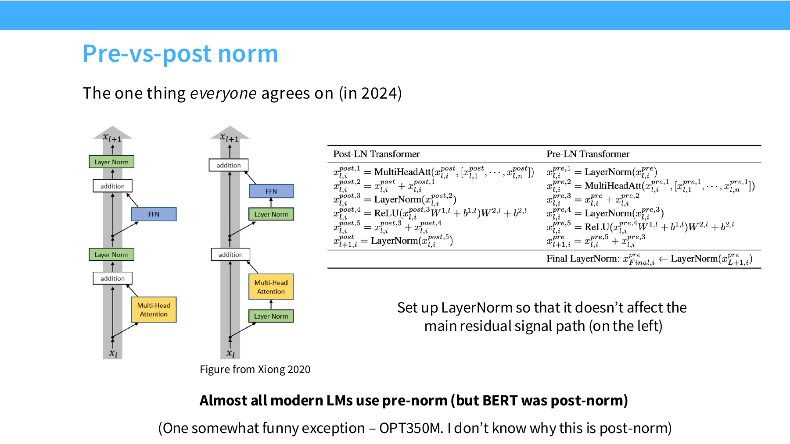

### 3.2 为什么现代模型几乎都用 pre-norm

原讲义态度非常明确：

> 这几乎是 2024 年大家唯一普遍同意的事情。

背后的直觉是：

- 残差连接的价值在于提供稳定的信息与梯度通路
- 如果 LayerNorm 直接卡在主残差路径上，会改变这条通路的“直达性”
- pre-norm 把 norm 放到分支里，能更好保留残差路径的好处

slide 中给出的几类解释包括：

- gradient attenuation
- gradient spikes
- 更稳定的优化
- 更容易使用较大的学习率
- 减少对 warmup 的依赖

### 3.3 一个更工程化的理解

把这个问题说得更工程一点：

- 深层网络训练最怕梯度传播不稳
- 残差本来是为了解决深网络优化难题
- 所以最好不要让归一化过度干扰主残差流

这也是为什么现代 decoder-only LLM 基本默认：

- pre-norm

即便某些历史模型用了 post-norm，也更像旧时代遗留，而不是现代默认。

### 3.4 “double norm” 是什么

slide 还提到一个新趋势：所谓的 “double norm”。

它的思路不是回到传统 post-norm，而是：

- block 内部仍然保持 pre-norm
- 但在残差流之外，再加一个额外的归一化位置

你可以把它理解成：

- 不破坏 pre-norm 的核心优势
- 同时尝试进一步稳定输出分布

这类做法在一些较新的模型中出现，但还没有像 pre-norm 那样形成绝对共识。

---

## 4. LayerNorm、RMSNorm 与去 bias：现代块结构的主流选择

### 4.1 LayerNorm 在做什么

传统 LayerNorm 对每个 token 的 hidden 向量做归一化，通常会减均值、除标准差，再乘可学习参数：

\[
\mathrm{LayerNorm}(x) = \gamma \cdot \frac{x - \mu}{\sqrt{\sigma^2 + \epsilon}} + \beta
\]

这里：

- `γ` 是 scale
- `β` 是 bias
- 会显式减去均值

### 4.2 RMSNorm 在做什么

RMSNorm 更简单，它不减均值，只按均方根做缩放：

\[
\mathrm{RMSNorm}(x) = \gamma \cdot \frac{x}{\sqrt{\frac{1}{d}\sum_i x_i^2 + \epsilon}}
\]

也就是说：

- 不做 mean-centering
- 通常没有 bias
- 参数更少，访存更轻

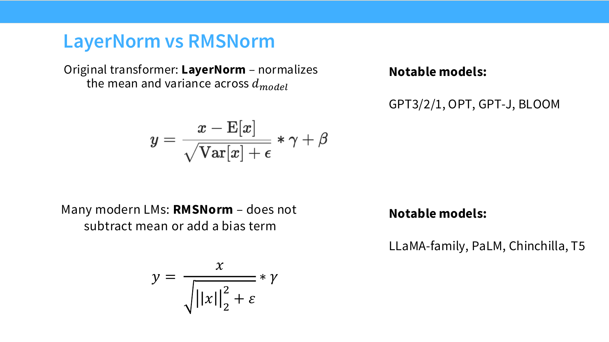

### 4.3 为什么很多现代模型偏向 RMSNorm

讲义里给出的主因很朴素：

- 更快
- 参数更少
- 运行时数据搬运更少
- 实际效果通常不差

一个重要提醒是：

> FLOPs 不是 runtime。

即使 RMSNorm 相比 LayerNorm 少掉的浮点操作看起来不大，它依然可能带来真实 wall-clock 改善，因为现代 GPU 系统里很多瓶颈来自：

- memory access
- kernel launch
- 数据搬运

而不是单纯的算术数量。

### 4.4 为什么“少一点点操作”也可能有意义

在 lecture2 里我们学过：

- 大头 FLOPs 确实来自 matmul

但这并不意味着小组件的优化无意义。因为：

- matmul 主导 FLOPs
- norm、bias、reshape、memory movement 常常影响实际吞吐和 kernel 效率

也就是说：

- “不占 FLOPs 大头” 不等于 “不影响速度”

这是现代训练工程里一个非常重要的思维转变。

### 4.5 去掉 bias 为什么也成了主流

slide 还提到一个趋势：

> 现代 Transformer 往往连 linear 层和 norm 层里的 bias 都省掉。

原因主要有两个：

- 节省参数和访存
- 有时对优化稳定性更友好

对超大模型来说，这种简化积累起来是有意义的：

- 少一个 bias 向量不算什么
- 但每层、每模块、每次前向后向都少一点，整体就有价值

### 4.6 一个最小 RMSNorm 实现

```python
import torch
from torch import nn


class RMSNorm(nn.Module):
    def __init__(self, dim: int, eps: float = 1e-6):
        super().__init__()
        self.eps = eps
        self.weight = nn.Parameter(torch.ones(dim))

    def forward(self, x: torch.Tensor) -> torch.Tensor:
        rms = x.pow(2).mean(dim=-1, keepdim=True).add(self.eps).rsqrt()
        return x * rms * self.weight
```

这个实现正好对应 RMSNorm 的本质：

- 不减均值
- 只按均方根缩放
- 只有 scale，没有 bias

### 4.7 这一节要带走的结论

- pre-norm 基本已成现代主流
- RMSNorm 是现代 dense LLM 的常见默认选择
- 去掉 bias 是常见配套操作
- 不要只盯 FLOPs，要考虑数据移动和实际吞吐

---

## 5. FFN 与激活函数：为什么 SwiGLU 成了近年的默认答案

### 5.1 FFN 不只是“两层 MLP”

标准 Transformer 的前馈层通常写成：

\[
\mathrm{FFN}(x) = \phi(xW_1)W_2
\]

其中 `φ` 是激活函数。

最早常见的是：

- ReLU

后来很多 GPT 系列用了：

- GeLU

而近几年大量模型转向：

- GeGLU
- SwiGLU

### 5.2 为什么会有这么多激活函数

因为 FFN 是 Transformer 中非常重要的非线性来源。不同激活的差别体现在：

- 表达能力
- 优化稳定性
- 参数利用效率
- 与大规模训练的兼容性

### 5.3 ReLU 和 GeLU

最基础版本：

```python
import torch
import torch.nn.functional as F

x = torch.randn(4, 8)

relu_y = F.relu(x)
gelu_y = F.gelu(x)
```

直觉上：

- `ReLU`：简单、硬阈值、便宜
- `GeLU`：更平滑，GPT 系模型长期使用

### 5.4 什么是 GLU 家族

GLU 的核心思想不是换一个单独激活，而是：

> 给 FFN 加一个门控分支，让一个分支去调制另一个分支。

slide 中先从 ReGLU 讲起：

\[
\mathrm{FF}_{\mathrm{ReGLU}}(x) =
(\max(0, xW_1) \otimes xV) W_2
\]

这里的关键变化是：

- 不再只是 `activation(xW1)`
- 而是 `activation(xW1) * gate(xV)`

也就是典型的 gating 思路。

### 5.5 为什么 gating 有可能更强

门控机制本质上提供了更细粒度的特征选择能力：

- 某些通道可以被增强
- 某些通道可以被压低
- 非线性不仅来自激活，也来自乘法式调制

这类结构在大模型里往往能带来：

- 更好的参数利用
- 稳定但不算特别夸张的性能提升

### 5.6 SwiGLU 与 GeGLU 为什么流行

讲义列出的现代模型里，大量后 2023 模型都偏向：

- SwiGLU
- GeGLU

其中 SwiGLU 常写成：

\[
\mathrm{SwiGLU}(x) =
(\mathrm{Swish}(xW_1) \otimes xV)W_2
\]

而 `Swish(z) = z \cdot \sigma(z)`。

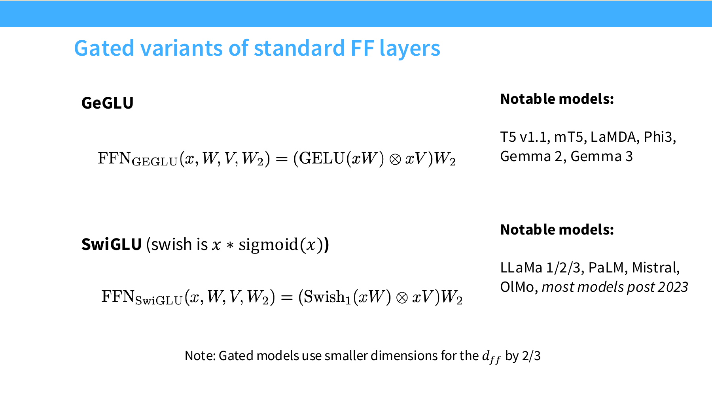

### 5.7 为什么 gated FFN 经常把 `d_ff` 缩小到约 `8/3 d_model`

这是很多同学第一次看到会疑惑的地方。

标准 FFN 常见配置是：

\[
d_{ff} = 4d_{model}
\]

但 gated 版本会多出一条投影分支，因此参数量增加。如果还保持原来的 `4d_model`，整体 FFN 成本会变大太多。

所以工程上常见折中是：

\[
d_{ff} \approx \frac{8}{3} d_{model}
\]

这样 gated FFN 的总参数量与标准 `4d_model` FFN 维持在相近量级。

### 5.8 一个最小 SwiGLU 实现

```python
import torch
from torch import nn
import torch.nn.functional as F


class SwiGLU(nn.Module):
    def __init__(self, dim: int, hidden_dim: int):
        super().__init__()
        self.w1 = nn.Linear(dim, hidden_dim, bias=False)
        self.w_gate = nn.Linear(dim, hidden_dim, bias=False)
        self.w2 = nn.Linear(hidden_dim, dim, bias=False)

    def forward(self, x: torch.Tensor) -> torch.Tensor:
        return self.w2(F.silu(self.w1(x)) * self.w_gate(x))
```

### 5.9 这一节的现实结论

- ReLU、GeLU 都能做出好模型
- *GLU 不是绝对必要，但经验上通常是更好的默认项
- 如果没有特殊理由，现代开源 LLM 常从 SwiGLU 起步

---

## 6. Serial block 与 parallel block：块内并行到底值不值得

### 6.1 标准 block 是串行的

传统 block 往往是：

1. attention
2. 然后 MLP

即：

```python
h = x + Attention(Norm(x))
y = h + MLP(Norm(h))
```

### 6.2 并行 block 的想法

parallel block 的思路是：

- 用同一个归一化输入同时喂给 attention 和 MLP
- 两个分支并行算
- 最后再合并

形式上更像：

```python
n = Norm(x)
y = x + Attention(n) + MLP(n)
```

### 6.3 这样做的好处

slide 给出的理由包括：

- LayerNorm 可以共享
- 若实现得当，矩阵乘法可以更好融合
- 有潜在计算效率优势

它未必一定显著提升质量，但在系统层面可能更高效。

### 6.4 工程判断

这一点不像 pre-norm 那么“板上钉钉”。更准确地说：

- parallel block 是一种值得考虑的系统优化
- 但它不是所有现代 LLM 的默认铁律

如果你的目标是：

- 做一个稳妥、复现资料多的模型

那么串行 block 仍然是完全合理的起点。

---

## 7. 位置编码全景图：从绝对位置到相对位置

位置编码这一节是 lecture3 的重点之一，因为现代大模型在这件事上确实发生了明显收敛。

### 7.1 三大类位置编码

slide 把位置编码分成三大类：

1. 正弦余弦位置编码
2. 绝对位置向量
3. 相对位置编码

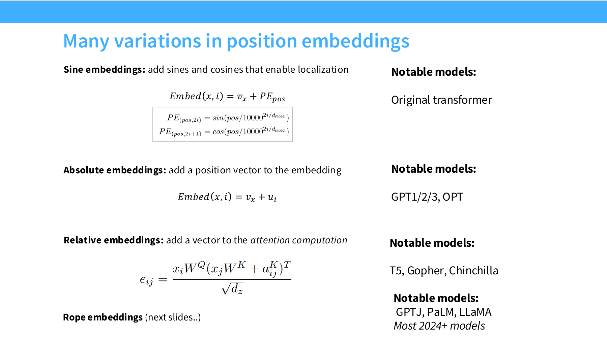

不过这里我没有直接插第 30 页截图，因为文中会把它拆开讲得更系统。

### 7.2 正弦余弦位置编码

经典写法是把一个固定函数 `PE(pos)` 加到 token embedding 上：

\[
\mathrm{Embed}(x_i, i) = v_{x_i} + PE_i
\]

优点：

- 不引入额外可学习位置参数
- 对更长位置有一定外推直觉

缺点：

- 对现代 decoder-only LLM 来说，往往不是最强默认项

### 7.3 绝对位置嵌入

做法更直接：

\[
\mathrm{Embed}(x_i, i) = v_{x_i} + u_i
\]

其中 `u_i` 是第 `i` 个位置的可学习向量。

优点：

- 简单
- 容易实现

缺点：

- 更依赖训练时见过的位置范围
- 对相对位置关系的表达不够“结构化”

### 7.4 相对位置编码

相对位置编码的目标是：

> attention 的位置依赖最好只与 `i - j` 有关，而不是与绝对位置 `i`、`j` 分别绑定。

这和语言建模中的很多归纳偏置是契合的，因为“离当前位置多远”通常比“绝对位于第 3821 个 token”更有意义。

---

## 8. RoPE：现代 LLM 最常见的位置编码

### 8.1 RoPE 想解决什么问题

RoPE 的核心目标是：

- 让注意力中的位置信息更自然地体现为相对位置信号
- 同时保留 inner product 计算结构

讲义的高层要求写成：

\[
\langle f(x, i), f(y, j) \rangle = g(x, y, i-j)
\]

也就是说：

- query/key 的相互作用最好只依赖相对位移 `i-j`

### 8.2 RoPE 的核心直觉：旋转

slide 用了一个非常直观的思路：

- 不去“加一个位置向量”
- 而是根据位置对 embedding 做旋转

因为：

> 内积在适当构造的旋转下，可以把绝对位置变成相对位移关系。

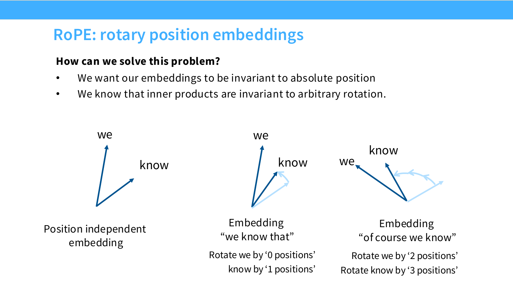

### 8.3 RoPE 怎么做旋转

RoPE 的做法是：

- 把 hidden 维按两两配对
- 每一对维度都看作二维平面中的一个向量
- 对每个位置 `m` 按特定角度旋转

这也是为什么很多解释会说：

- RoPE 可以从复数乘法的角度理解

### 8.4 RoPE 的数学形式

RoPE 的本质可以理解为：

\[
q_m' = R_m q_m,\quad k_n' = R_n k_n
\]

其中 `R_m` 是与位置 `m` 相关的块对角旋转矩阵。

slide 给出了更完整的矩阵形式：

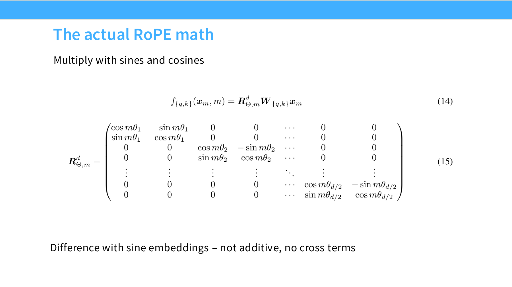

这张图最重要的不是记住整个矩阵，而是记住两个结构性特征：

- 维度两两配对旋转
- 使用 `sin` 和 `cos`

### 8.5 RoPE 与正弦位置编码的关键区别

讲义特别强调：

- 正弦位置编码是“加法式”的
- RoPE 是“乘法 / 旋转式”的

这带来两个重要差别：

- 没有同样的 cross terms
- 更自然地作用在 attention 的 query/key 相互作用上

### 8.6 为什么 RoPE 会成为现代默认选择

经验上它有几个优点：

- 相对位置归纳偏置更自然
- 易于嵌入标准 attention 实现
- 与现代 decoder-only 架构搭配良好
- 在大量开源模型中已经成为默认经验

### 8.7 一个最小 RoPE 实现思路

下面给一个教学版写法，只展示核心张量变换思路：

```python
import torch


def rotate_half(x: torch.Tensor) -> torch.Tensor:
    x1 = x[..., ::2]
    x2 = x[..., 1::2]
    return torch.stack([-x2, x1], dim=-1).flatten(-2)


def apply_rope(x: torch.Tensor, cos: torch.Tensor, sin: torch.Tensor) -> torch.Tensor:
    return x * cos + rotate_half(x) * sin
```

如果 `x` 的形状是：

```python
[batch, heads, seq_len, head_dim]
```

那么：

- `cos` 和 `sin` 通常广播到同形状
- query 和 key 都要应用 RoPE
- value 一般不做 RoPE

### 8.8 RoPE 在 attention 中的位置

它通常发生在：

1. 输入投影出 `Q, K, V`
2. 对 `Q, K` 应用 RoPE
3. 再做注意力分数计算

伪代码：

```python
q = q_proj(x)
k = k_proj(x)
v = v_proj(x)

q = apply_rope(q, cos, sin)
k = apply_rope(k, cos, sin)

att = softmax(q @ k.transpose(-2, -1) / sqrt(d))
out = att @ v
```

---

## 9. 超参数经验：`d_ff`、head dim、深宽比例、词表大小

这一部分是 lecture3 非常有价值的地方，因为它给出了很多“不要过度神秘化”的结论。

### 9.1 `d_ff` 与 `d_model` 的关系

最常见经验法则：

\[
d_{ff} = 4d_{model}
\]

这是非常普遍的默认值。

### 9.2 如果用了 GLU，为什么常变成 `8/3 d_model`

前面已经说过，gated FFN 会多出一条门控分支，因此常常把 `d_ff` 缩到：

\[
d_{ff} \approx \frac{8}{3}d_{model}
\]

slide 里列了不少模型的实际比例，基本落在 `2.5` 到 `4` 附近。


### 9.3 T5 为什么是著名例外

讲义特别点名 T5 的一个夸张例子：

- `d_ff = 65536`
- `d_model = 1024`

也就是：

\[
d_{ff} = 64d_{model}
\]

这说明一件事：

- 超参数不是数学真理
- 极端设置也可能 work

但经验上，现代模型并没有因此普遍采用这种激进比例，所以它更像“例外证明不是完全不可能”，而不是默认建议。

### 9.4 `num_heads * head_dim` 是否必须等于 `d_model`

严格来说，不必须。

但实际中，大多数模型还是大致遵守：

\[
\text{num\_heads} \times \text{head\_dim} \approx d_{model}
\]

slide 列出的多个模型例子显示：

- 很多模型比例就在 1 左右
- 少数 Google 系模型偏大一些

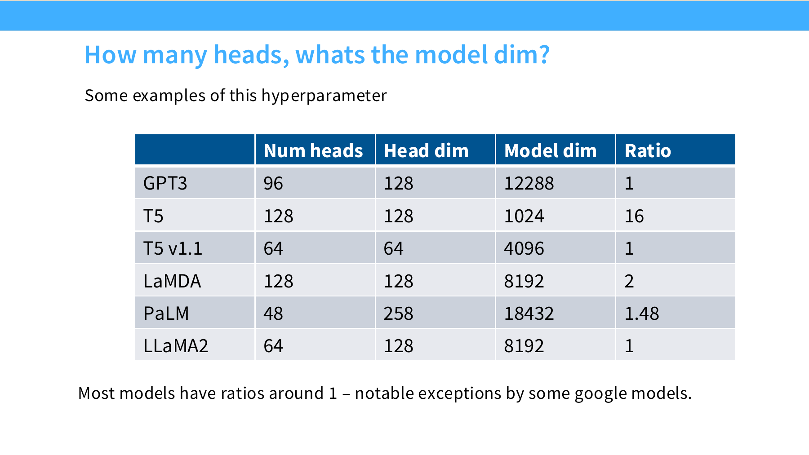

这一节想表达的是：

- 不要把这个关系神话成“必须成立”
- 但如果你没有特别强的理由，按它来通常是最稳妥的起点

### 9.5 模型应该更深还是更宽

slide 用 `d_model / n_layer` 这一类比值来展示现代模型的深宽比例。

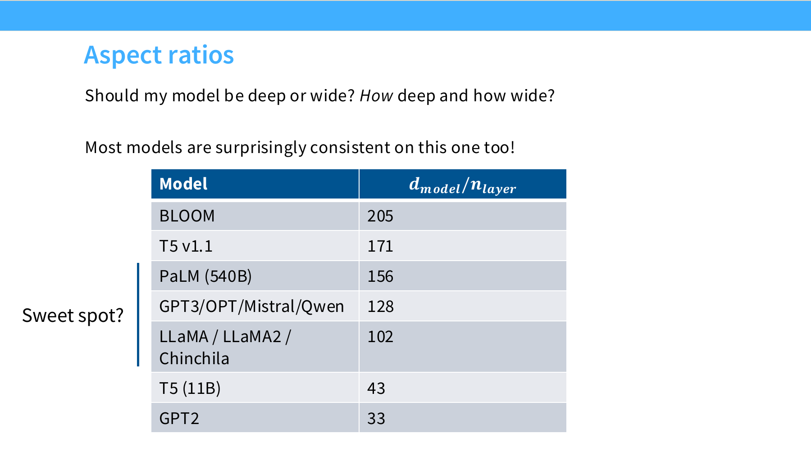

讲义给出的结论比较现实：

- 很深的模型更难并行
- latency 往往更高
- 系统约束会强烈影响“最佳”深宽比例

所以这不是一个纯理论问题，而是：

- 算法
- 并行策略
- 硬件
- 目标服务延迟

一起决定的。

### 9.6 词表应该多大

讲义给出的经验非常实用：

- 单语模型：常见 `30k - 50k`
- 多语或生产系统：常见 `100k - 250k`

这背后反映的是 tokenization trade-off：

- 词表太小：序列更长
- 词表太大：embedding / softmax 更重、训练和部署更贵

所以词表大小本质上不是“越大越先进”，而是：

- 服务语言范围
- token 碎片化程度
- 系统成本

三者之间的折中。

### 9.7 这一节最值得记住的态度

lecture3 对超参数问题的总体态度并不是“给你唯一正确答案”，而是：

- 现代大模型其实有很多保守而重复出现的默认值
- 真正的异常值很少
- 如果你不是在做很激进的探索，先站在这些默认值上更合理

---

## 10. 正则化与稳定训练：dropout、weight decay、z-loss、QK norm

### 10.1 大模型预训练还需要 regularization 吗

直觉上很多人会说：

- 数据很多
- 只扫一遍语料
- 好像不容易过拟合

这确实有一定道理，但 slide 给出的实际观察是：

- 不是完全不 regularize
- 只是 regularization 的角色更像优化动力学控制，而不只是防过拟合

### 10.2 dropout 与 weight decay 的现实趋势

讲义展示了多个模型的做法：

- 较老模型更常用 dropout
- 较新模型往往更依赖 weight decay
- 一些新模型预训练时直接不做 dropout

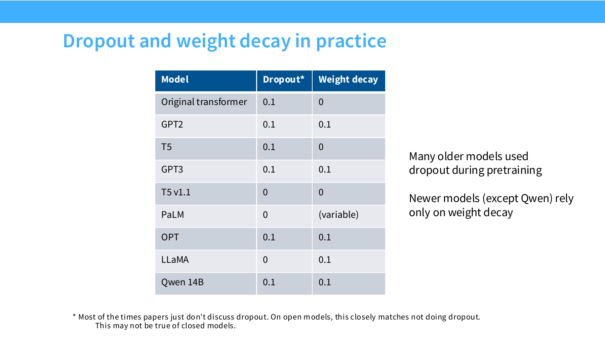

这说明：

- dropout 不是现代 LLM 预训练的绝对默认项
- weight decay 仍然很常见

### 10.3 为什么 weight decay 在这里不是“防过拟合教科书故事”

讲义特别提醒：

> 在 LLM 里，weight decay 的作用并不只是控制过拟合。

它还会与：

- learning rate schedule
- cosine decay
- 参数尺度演化

发生复杂交互，因此更像一个优化动态调节项。

### 10.4 训练稳定性为什么总绕不开 softmax

这一节后半部分是稳定性 tricks，核心警告是：

> 小心 softmax。

因为 softmax 涉及：

- 指数
- 归一化
- 数值范围极易放大

不稳定通常发生在两个地方：

1. 输出层 softmax
2. attention 内部的 softmax

### 10.5 z-loss 是什么

z-loss 是对输出 logits 稳定性的一个 trick。它的目标不是替代交叉熵，而是：

- 约束 logits 尺度
- 缓解数值异常
- 改善训练稳定性

slide 中提到 PaLM 使用了这个技巧，后续也有若干模型跟进。

你可以把它理解成：

- 给 softmax 前的 logits 再加一个稳定性辅助约束

### 10.6 QK norm 是什么

QK norm 的做法是：

- 在进入 attention softmax 之前
- 先对 query 和 key 做 norm

也就是：

```python
q = q_norm(q)
k = k_norm(k)
scores = q @ k.transpose(-2, -1)
```

它的目标很明确：

- 不要让 `qk^T` 的数值范围失控
- 让注意力 softmax 更稳定

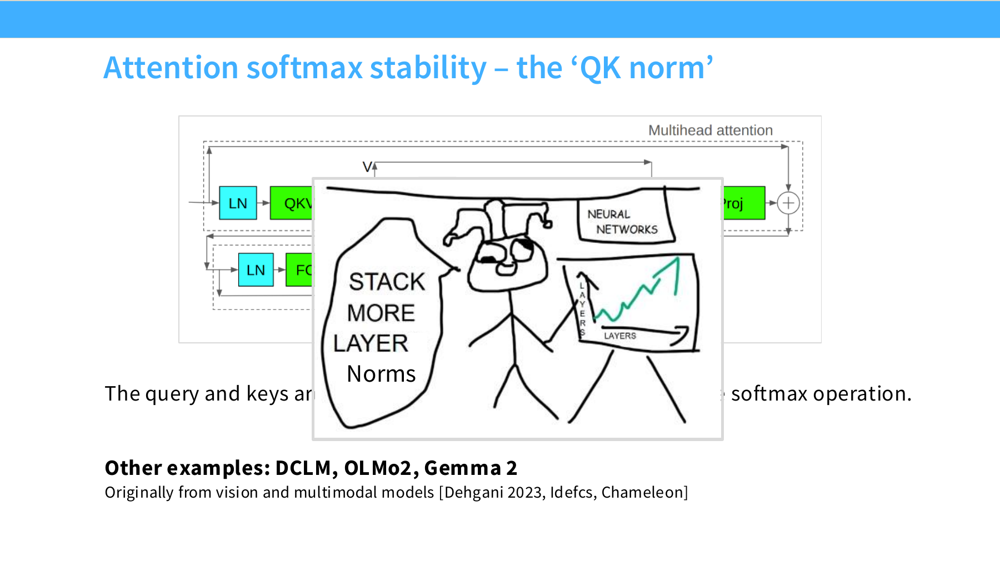

### 10.7 logit soft-capping

另一个更直接的做法是：

- 用 `tanh` 或类似方式把 logits 限幅

好处：

- 防止 logits 爆炸

代价：

- 可能影响表达能力
- 也可能引入性能权衡

### 10.8 稳定训练的真实含义

这节真正想表达的是：

- 大模型训练不稳定，不一定是你代码写错了
- 可能是架构和数值设计没有把风险点压住

现代稳定性 trick 的大方向是：

- 避免主残差流被过度扰动
- 控制 softmax 相关数值范围
- 让优化过程更平滑

---

## 11. 注意力推理优化：KV cache、MQA、GQA、滑动窗口注意力

这一部分非常重要，因为它回答的是：

> 为什么很多 attention 变体的目标其实不是训练更准，而是推理更省。

### 11.1 训练时 attention 和推理时 attention 不是同一个系统问题

训练时：

- 可以并行处理整个序列
- arithmetic intensity 通常还不错

推理时：

- token 必须一步一步生成
- 不能像训练那样完全并行
- 于是 KV cache 的搬运和读取开始变成核心成本

### 11.2 KV cache 为什么重要

增量解码时，如果每生成一个 token 都重新算完整历史 attention，会非常浪费。

所以通常会缓存：

- past keys
- past values

这就是 KV cache。

它的价值在于：

- 避免重复计算历史 K/V
- 让每一步只新增一个 token 的 K/V

但它也带来一个新瓶颈：

- 你必须反复从显存里读取越来越长的 KV cache

### 11.3 MQA：为什么要减少 key/value 头数

MQA 的核心思想是：

- query 仍然多头
- key/value 不再每个 head 各一份
- 而是共享得更多

这样做的直接收益是：

- KV cache 更小
- 推理时内存读写更少
- 解码吞吐更高

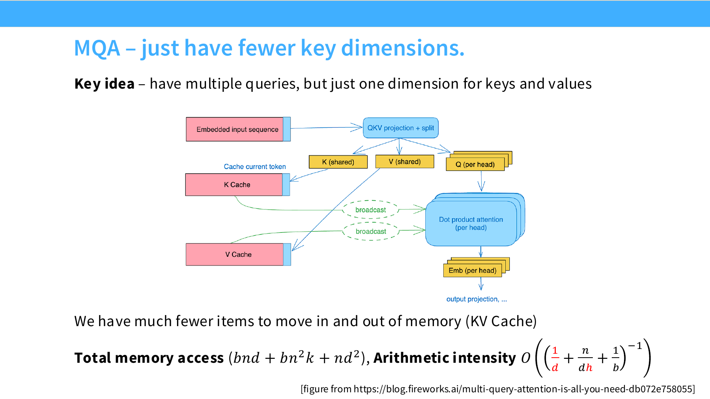

### 11.4 为什么 MQA 有时会伤性能

因为它本质上在做一种表达能力压缩：

- query 头很多
- 但 K/V 表达更少样

讲义提到：

- MQA 可能有小幅 PPL 损失
- GQA 往往能在效率和表达之间取得更好平衡

### 11.5 GQA：在 MHA 和 MQA 之间折中

GQA 的做法是：

- 不像 MHA 那样每个 query head 都有独立 K/V
- 也不像 MQA 那样全都共享一套 K/V
- 而是若干 query head 共享一组 K/V

因此它是一个更柔和的折中：

- 比 MHA 省缓存
- 比 MQA 更保留表达能力

### 11.6 滑动窗口注意力为什么出现

全局注意力的成本是二次的。对于超长上下文，很多时候没必要每层都看完整历史。

所以会出现：

- sparse attention
- sliding window attention

其核心思想是：

- 每层只看局部窗口或结构化子集
- 利用网络深度逐层传播更远信息

### 11.7 为什么现代模型会交替使用 full attention 与 local attention

slide 末尾提到了一种很实用的设计：

- 大多数层使用更便宜的局部注意力
- 每隔几层插一个 full attention

这样做的目的：

- 保留长程信息通路
- 降低平均计算和访存成本

### 11.8 一个最小 GQA 形状示意

如果是标准多头注意力，可能是：

```python
q.shape = [B, Hq, T, Dh]
k.shape = [B, Hq, T, Dh]
v.shape = [B, Hq, T, Dh]
```

而 GQA 里往往是：

```python
q.shape = [B, Hq, T, Dh]
k.shape = [B, Hkv, T, Dh]
v.shape = [B, Hkv, T, Dh]
```

其中：

- `Hkv < Hq`

再通过 head grouping 把多个 query head 对应到同一组 K/V。

---

## 12. 如果今天自己做一个现代 LM，默认怎么选

结合 lecture3 的整体倾向，如果今天你要做一个“稳妥的现代 dense decoder-only LM”，在没有特别研究目标时，一个合理的默认起点大概是：

### 12.1 架构默认项

- pre-norm
- RMSNorm
- 无 bias 的线性层
- RoPE
- SwiGLU
- 常规串行 block，除非你特别关心系统优化

### 12.2 超参数默认项

- `d_ff = 4d_model`
- 如果用 GLU，`d_ff ≈ 8/3 d_model`
- `num_heads * head_dim ≈ d_model`
- 词表大小按语种和服务场景保守选取
- 深宽比例先贴近已有成功模型

### 12.3 训练默认项

- 不迷信 dropout
- 合理使用 weight decay
- 关注 softmax 稳定性
- 必要时考虑 z-loss、QK norm 或其他 logit 控制手段

### 12.4 推理默认项

- 长上下文和高吞吐部署场景下，优先考虑 GQA
- 需要进一步压缩时再考虑更激进的 MQA
- 超长序列场景下考虑 sliding window / hybrid attention

---

## 13. 高频考点与常见误区

### 13.1 高频结论

- 几乎所有现代 LLM 都偏向 pre-norm
- RMSNorm 是非常常见的现代选择
- 去 bias 是常见工程简化
- SwiGLU / GeGLU 是近年高频默认项
- RoPE 已成为大量现代 LLM 的标准位置编码
- `d_ff = 4d_model` 仍是最稳的默认经验
- 使用 GLU 时 `d_ff` 常缩到约 `8/3 d_model`
- 推理优化里，MQA/GQA 的核心目标是降低 KV cache 访存成本
- dropout 在新模型预训练中并不总是默认开启
- 稳定训练常常需要关注 softmax 数值行为

### 13.2 常见误区

#### 误区 1：只要 FLOPs 低，运行一定更快

错。很多真实瓶颈来自 memory movement 和 kernel 效率。

#### 误区 2：post-norm 只是另一种同样流行的写法

错。现代 dense LLM 中它已经明显不是主流默认项。

#### 误区 3：RoPE 只是“另一种可学习位置向量”

错。RoPE 的核心是旋转式、相对位置结构，而不是简单相加。

#### 误区 4：MQA/GQA 是为了训练更准

通常不是。它们的主要价值是推理效率，尤其是 KV cache 相关成本。

#### 误区 5：dropout 越多越稳

错。现代大模型预训练里，dropout 并不是无脑默认增益项。

---

## 14. 附：最小代码实现片段

这一节不给完整 Transformer，只给 lecture3 最相关的几个组件。

### 14.1 RMSNorm

```python
import torch
from torch import nn


class RMSNorm(nn.Module):
    def __init__(self, dim: int, eps: float = 1e-6):
        super().__init__()
        self.eps = eps
        self.weight = nn.Parameter(torch.ones(dim))

    def forward(self, x: torch.Tensor) -> torch.Tensor:
        return x * torch.rsqrt(x.pow(2).mean(dim=-1, keepdim=True) + self.eps) * self.weight
```

### 14.2 SwiGLU

```python
import torch
import torch.nn.functional as F
from torch import nn


class SwiGLU(nn.Module):
    def __init__(self, dim: int, hidden_dim: int):
        super().__init__()
        self.w1 = nn.Linear(dim, hidden_dim, bias=False)
        self.w_gate = nn.Linear(dim, hidden_dim, bias=False)
        self.w2 = nn.Linear(hidden_dim, dim, bias=False)

    def forward(self, x: torch.Tensor) -> torch.Tensor:
        return self.w2(F.silu(self.w1(x)) * self.w_gate(x))
```

### 14.3 RoPE

```python
import torch


def rotate_half(x: torch.Tensor) -> torch.Tensor:
    x1 = x[..., ::2]
    x2 = x[..., 1::2]
    return torch.stack((-x2, x1), dim=-1).flatten(-2)


def apply_rope(x: torch.Tensor, cos: torch.Tensor, sin: torch.Tensor) -> torch.Tensor:
    return x * cos + rotate_half(x) * sin
```

### 14.4 pre-norm block 骨架

```python
class PreNormBlock(nn.Module):
    def __init__(self, dim, attn, ffn):
        super().__init__()
        self.norm1 = RMSNorm(dim)
        self.norm2 = RMSNorm(dim)
        self.attn = attn
        self.ffn = ffn

    def forward(self, x):
        x = x + self.attn(self.norm1(x))
        x = x + self.ffn(self.norm2(x))
        return x
```

### 14.5 一个 lecture3 风格的“现代默认配置”

```python
modern_defaults = {
    "norm": "RMSNorm",
    "residual_order": "pre-norm",
    "activation": "SwiGLU",
    "position_embedding": "RoPE",
    "linear_bias": False,
    "attn_variant": "MHA or GQA depending on inference budget",
}
```

---

## 15. 一句话总结构图

如果只用一句话概括 lecture3：

> 现代大语言模型的主流演化方向，并不是推翻 Transformer，而是在归一化、FFN、位置编码、稳定性和推理成本这些细节上，逐步形成一套偏向 pre-norm、RMSNorm、RoPE、SwiGLU 与高效 attention 变体的工程共识。
