# CS336 Lecture 4 学习讲义

> 副标题：Mixture of Experts 的架构、路由、训练稳定性与系统代价
>
> 适用对象：正在上 CS336 的课程同学
>
> 依据材料：[2025 Lecture 4 - MoEs.pdf](/home/tfx/rust_projects/cs336/lecture/2025%20Lecture%204%20-%20MoEs.pdf)

---

## 目录

1. 这节课在讲什么
2. 什么是 MoE：从 dense FFN 到 sparse expert layer
3. 为什么 MoE 重新流行
4. 一个现代 LLM 的 MoE 层长什么样
5. Routing：MoE 的核心
6. 为什么训练 MoE 很难
7. Load balancing、稳定性与训练技巧
8. 系统与基础设施视角下的 MoE
9. 近期代表性设计：Switch、Mixtral、Qwen、DeepSeek、OlMoE
10. 如果今天自己做一个 MoE，该默认怎么想
11. 高频考点与常见误区
12. 附：最小 MoE 代码骨架
13. 一句话总结构图

---

## 1. 这节课在讲什么

`lecture2` 讲的是训练一个模型最底层需要哪些 primitive：张量、内存、FLOPs、优化器、训练循环。  
`lecture3` 讲的是现代 dense Transformer 的主流架构共识：pre-norm、RMSNorm、RoPE、SwiGLU、若干稳定性与推理优化技巧。

而 `lecture4` 讨论的是一个更进一步的问题：

> 如果我不想让每个 token 都走完整个 dense 模型，而是希望“只激活一部分参数”，那我该怎么设计模型？

这就是 Mixture of Experts（MoE）的核心问题。

这节课不是在讲一个“完全不同于 Transformer 的模型家族”，而是在讲一种重要扩展：

- Transformer 主体结构仍保留
- 但 FFN 不再是单一 dense MLP
- 而是变成“多个 expert + 一个 router”

这会带来一系列新的问题：

- 为什么参数量可以大幅增加，但 FLOPs 不一定同步增加
- 路由怎么做
- 为什么离散路由很难训练
- 为什么 load balancing 几乎成了 MoE 的生命线
- 为什么 MoE 很强，但基础设施更复杂

从课程主线看，这一讲相当于把“现代 dense LLM”的架构讨论推进到：

- **稀疏激活（sparsity）**
- **条件计算（conditional computation）**
- **跨设备系统设计**

这几件事上。

---

## 2. 什么是 MoE：从 dense FFN 到 sparse expert layer

### 2.1 最核心的结构替换

MoE 的最典型做法并不是把整个 Transformer 都改掉，而是把 block 中的 FFN 部分替换掉。

在标准 dense Transformer block 里，你通常有：

```python
x = x + Attention(Norm(x))
x = x + FFN(Norm(x))
```

而在典型的 MoE Transformer block 中，第二项会变成：

```python
x = x + Attention(Norm(x))
x = x + MoE(Norm(x))
```

也就是说：

- attention 通常还是 dense 的
- 被稀疏化的主要是 FFN

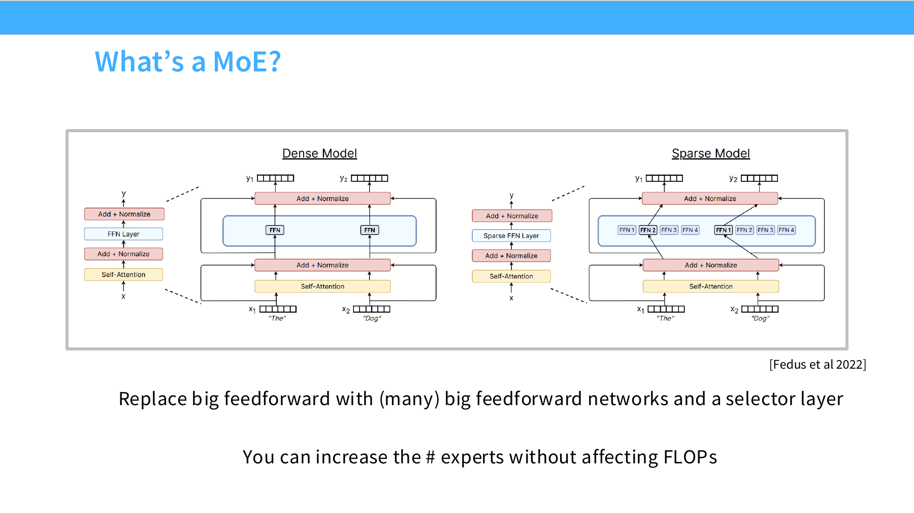

这张图其实就包含了 MoE 最重要的一句话：

> 用很多个大前馈网络（experts）替代一个大前馈网络，再加一个 selector / router 决定每个 token 走哪些 expert。

### 2.2 为什么“参数更多但 FLOPs 不一定更多”

这是很多人第一次接触 MoE 时最容易误解的点。

如果你有：

- 1 个大 FFN

改成：

- 64 个大 FFN expert

看起来参数量会膨胀很多。但真正的关键是：

- 每个 token **不会**走所有 64 个 expert
- 它只会被 router 分配给其中少数几个

例如：

- 总共有 64 个 expert
- 但每个 token 只激活 top-2

那么：

- 总参数量非常大
- 但单个 token 实际参与的计算量仍然只对应少量 active experts

这就是 MoE 的本质：

> 用更大的“总模型容量”换取接近不变的“单 token 计算量”。

### 2.3 一个最小直觉例子

假设一个 dense FFN 需要：

- 一次 `d_model -> d_ff`
- 一次 `d_ff -> d_model`

如果你把它复制成 16 个 expert：

- 总参数量大约会膨胀 16 倍

但如果每个 token 只走 2 个 expert：

- token 级 FLOPs 只近似变成原来的 2 倍（再加上路由开销）
- 而不是 16 倍

这也是为什么人们会说：

- MoE 是一种“用稀疏激活换更大参数规模”的办法

### 2.4 稠密模型和稀疏模型的直觉差别

可以把二者粗略理解成：

#### Dense 模型

- 每个 token 都走同一套参数
- 简单、稳定、容易实现

#### MoE 模型

- 不同 token 走不同 expert 子网络
- 参数容量更大
- 但计算路径更复杂，训练和系统都更难

所以 MoE 不是白拿收益，而是在进行一种明确的 trade-off：

- 更大总容量
- 更复杂路由
- 更高系统复杂度

---

## 3. 为什么 MoE 重新流行

lecture4 前面连续几页都在回答同一个问题：

> MoE 不是新东西，为什么它这几年突然又变热了？

答案大致可以归成三类。

### 3.1 同样 FLOPs 下，更多参数往往更强

slide 中最核心的动机之一是：

> 在相近 FLOPs 预算下，更多参数的 MoE 往往优于 dense 对照模型。

这非常符合 MoE 的直觉：

- dense 模型受限于“所有参数每次都必须被激活”
- MoE 则允许你把总容量做得更大，但每次只用一部分

因此在相同训练算力预算下，MoE 有可能获得更强的表示能力。

### 3.2 MoE 往往训练更快，至少在合适的系统条件下如此

slide 中还给出另一个很重要的经验观察：

- MoE 往往能更快达到某个目标性能

这不是说它每一步都无条件更快，而是说：

- 在多卡、多机、适当并行与稀疏实现良好的情况下
- 它可能以更低的训练成本达到相近甚至更好的性能

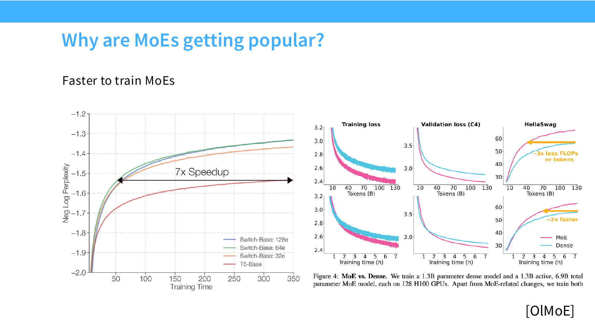

### 3.3 MoE 对大规模并行更友好

MoE 之所以吸引工业界，还有一个很现实的原因：

- 它天然适合跨更多设备扩展 expert 容量

因为：

- 不同 expert 可以部署在不同设备上
- 不需要所有参数同时参与每个 token 的计算

从系统视角看，它是一种很适合横向扩容参数容量的架构。

### 3.4 开源与闭源模型都在给出越来越多正面证据

lecture4 还强调了一个事实：

- 不只是某一两个模型在用 MoE
- 近年的高性能模型里，MoE 越来越常见

包括：

- 西方开源模型中的强模型
- 中国厂商的 Qwen / DeepSeek 系列
- 以及更系统化的 MoE ablation 工作

这意味着：

> MoE 不再只是“某个实验室的架构怪招”，而是已经积累了足够多的经验性支持。

### 3.5 但它没有更早普及，也不是没有原因

slide 也马上提醒了另一面：

- 基础设施复杂
- 优势更多体现在多机多卡
- 训练目标带有启发式成分
- 有时不稳定

也就是说，MoE 并不是“免费午餐”，它只是：

- 在今天的大规模训练环境中
- 变得越来越值得这份复杂度

---

## 4. 一个现代 LLM 的 MoE 层长什么样

### 4.1 典型位置：替换 MLP，不替换 attention

现代 LLM 中最典型的 MoE 做法是：

- 保留 self-attention 为 dense
- 把 block 中的 MLP / FFN 换成 MoE layer

这是最重要的默认认知。

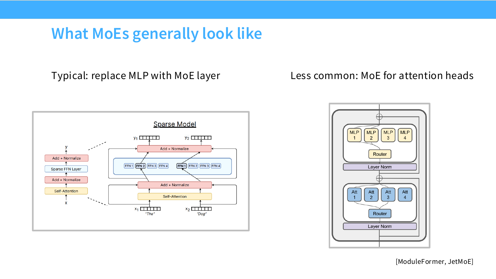

虽然 slide 也提到：

- attention heads 上做 MoE 也存在

但这不是主流路径。

### 4.2 一个最小 MoE 层的逻辑

给定输入 hidden states：

```python
u = Norm(x)
```

MoE 层通常做下面几步：

1. router 给每个 token 计算所有 expert 的分数
2. 选 top-k 个 expert
3. 把 token 分发给这些 expert
4. expert 各自执行 FFN
5. 把 expert 输出按 gate 权重聚合回来

伪代码可以写成：

```python
scores = router(u)                    # [tokens, num_experts]
topk_idx, topk_weight = topk(scores)  # 每个 token 只选 k 个 expert

outputs = 0
for e in selected_experts:
    outputs += gate[token, e] * expert_e(u_token)
```

### 4.3 shared experts 是什么

lecture4 提到近年一个很有代表性的变化：

- 除了 routed experts
- 还会加少量 shared experts

shared experts 的特点是：

- 它们总是开启
- 不依赖 router 做稀疏选择

直觉上，你可以把它理解成：

- 给所有 token 一条共同的“保底 dense 通路”
- 再额外加上 routed experts 提供更细粒度的 specialization

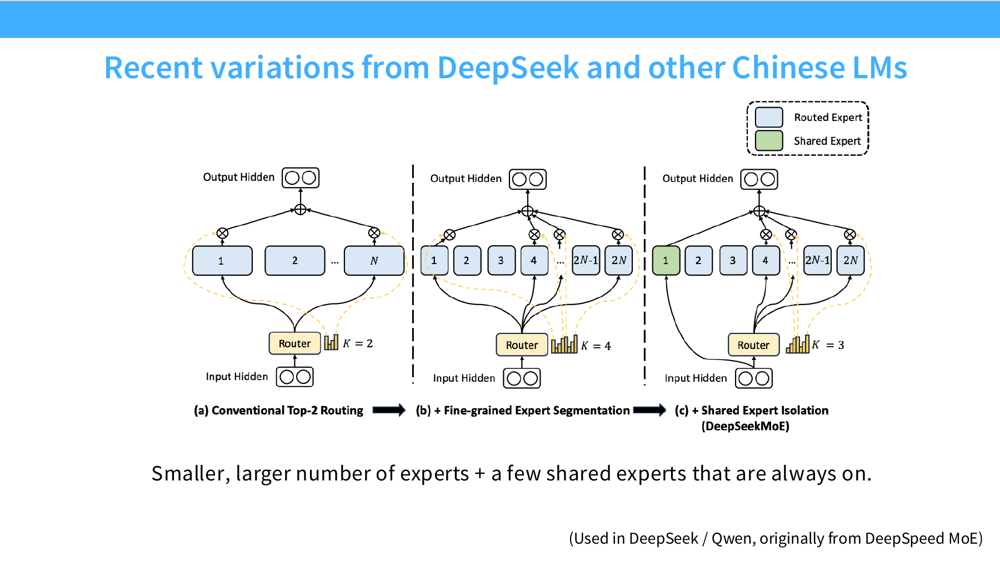

### 4.4 fine-grained experts 是什么

lecture4 里另一个关键词是：

- fine-grained experts

它表示：

- expert 数量更多
- 每个 expert 本身更小更细

这样会产生一种新的设计趋势：

- 不再是少数几个“大专家”
- 而是更多、更细粒度的专家

这种设计常见于 DeepSeek、Qwen 一类近期架构。

### 4.5 routed / active / shared 这三个数要区分开

MoE 论文里常见几个数字：

- `Routed experts`：总共有多少个可路由专家
- `Active experts`：每个 token 实际激活多少个专家
- `Shared experts`：始终开启的共享专家有多少个

这三个数必须分清，因为它们对应不同资源维度：

- routed：总容量
- active：每 token 实际 FLOPs
- shared：统一通路和额外 dense 负担

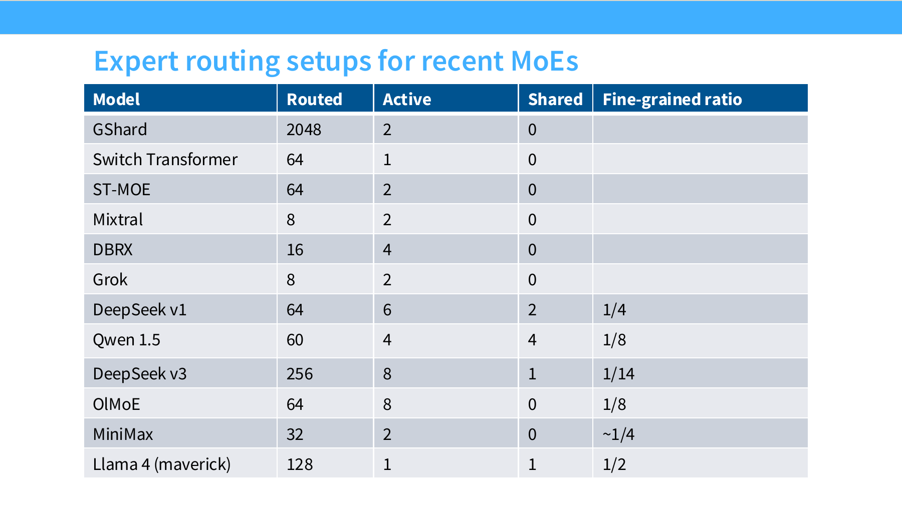

这张表最重要的启发不是记住每个模型的具体数字，而是看出趋势：

- routed experts 总数在不断增大
- active experts 通常保持在较小范围
- shared experts 是否有用，并没有完全共识

### 4.6 一个现代 MoE block 的心智模型

如果把 dense Transformer block 和 MoE Transformer block 做对照，可以这样记：

#### Dense

```python
x = x + Attention(Norm(x))
x = x + FFN(Norm(x))
```

#### MoE

```python
x = x + Attention(Norm(x))
x = x + SharedExperts(Norm(x)) + RoutedExperts(Norm(x))
```

不同论文细节会不同，但大方向就是：

- 用 sparse routed experts 扩总容量
- 用少量 shared path 稳住基础表达

---

## 5. Routing：MoE 的核心

MoE 真正的灵魂不在“很多个 FFN”本身，而在：

> 谁决定每个 token 应该去哪个 expert？

这个决策机制就是 routing。

### 5.1 routing 的三大类思路

lecture4 把 routing 粗略分成三类：

1. token chooses expert
2. expert chooses token
3. global routing via optimization

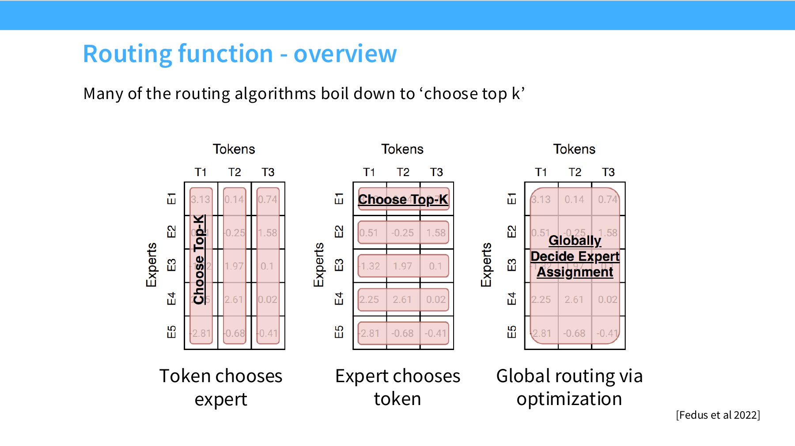

但实践里几乎所有现代大模型最终都收敛到第一类：

- token-choice top-k routing

### 5.2 为什么 top-k routing 成了现实默认值

因为它同时满足三件事：

1. 足够简单
2. 足够高效
3. 虽然启发式，但效果已经足够好

换句话说，top-k 不是“最优理论方案”，而是：

- 目前综合工程可行性和经验效果最好的方案

### 5.3 top-k routing 的基本形式

给定 token 表示 \(u_t\)，router 会为每个 expert 打分：

\[
s_{i,t} = f(u_t, e_i)
\]

然后从这些分数中选出 top-k experts。  
若 expert \(i\) 在 top-k 里，则其 gate 权重为：

\[
g_{i,t} = s_{i,t}
\]

否则：

\[
g_{i,t} = 0
\]

最终 token 的输出可写成：

\[
h_t = \sum_i g_{i,t}\,\text{FFN}_i(u_t) + u_t
\]

### 5.4 DeepSeek / Grok / Qwen 风格 vs Mixtral / DBRX / DeepSeek v3 风格

lecture4 还提到一个细节分歧：

- 有些模型在选出 top-k 之前就做 softmax
- 有些模型是 top-k 之后再 softmax

这不是表面差异，它会影响：

- gate 权重的归一化方式
- 被选 expert 之间的相对权重解释

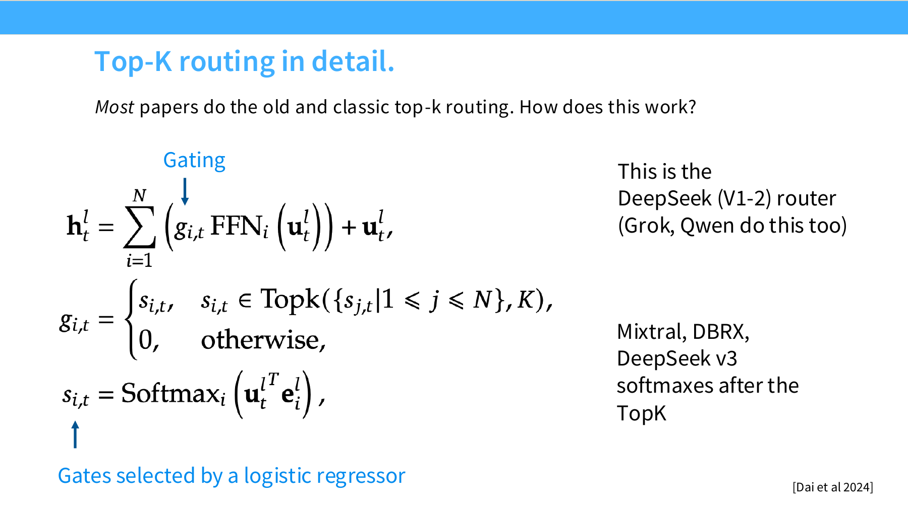

### 5.5 top-1、top-2、top-4、top-8 代表什么

这些数字表示：

- 每个 token 被送去多少个 routed experts

例如：

- Switch Transformer：`k = 1`
- Mixtral：`k = 2`
- DBRX：`k = 4`
- DeepSeek v3：更多 routed experts，但 active experts 仍保持较小值

这个参数直接影响：

- 每 token FLOPs
- expert specialization 程度
- 聚合稳定性

### 5.6 其他 routing 方法为什么不够主流

lecture4 也列出了其他几类做法：

- hash routing
- reinforcement learning 路由
- matching / assignment routing

但它们的问题通常是：

- 系统更复杂
- 优化更难
- 不一定带来足够大收益

这也是为什么你在大多数现代开源 MoE 里看到的仍然是：

- top-k

### 5.7 一个最小 top-k router 示例

```python
import torch


def topk_route(x, router_w, k):
    # x: [tokens, d_model]
    # router_w: [num_experts, d_model]
    scores = x @ router_w.T
    values, indices = torch.topk(scores, k=k, dim=-1)
    weights = torch.softmax(values, dim=-1)
    return indices, weights
```

这个实现很简化，但足够表达 top-k router 的核心：

- 先算所有 expert 分数
- 再做 top-k
- 再在被选专家之间归一化

---

## 6. 为什么训练 MoE 很难

lecture4 中最重要的一张“问题定义”页之一是这句话：

> 我们需要稀疏路由，才能在训练时高效；但稀疏门控决策本身又是不可导的。

这就是 MoE 训练的核心张力。

### 6.1 稀疏性是 MoE 的价值来源

如果你不做稀疏选择，而是让每个 token 都经过所有 expert：

- 那就几乎退化成把很多 FFN 全部算一遍
- FLOPs 会大幅上升
- MoE 失去最重要的效率意义

所以 MoE 必须依赖：

- 离散、稀疏的 expert 选择

### 6.2 但离散选择不容易反向传播

top-k 本质上是离散操作。  
离散决策通常对梯度不友好，因为：

- argmax / top-k 不是平滑函数
- 被丢掉的路径没有自然梯度

所以从优化角度看，MoE 从一开始就带着一个麻烦：

- 它的核心效率机制，正好也是优化难点

### 6.3 lecture4 给出的三类解决路线

slide 中总结了三条主要路径：

1. reinforcement learning
2. stochastic perturbations / stochastic approximations
3. heuristic balancing losses

而且讲义故意追问一句：

> 猜猜实践里大家真正用的是哪个？

答案基本是：

- 第三类启发式方法

### 6.4 RL 路由：从理论上更“正宗”，但实践中不够划算

RL 思路很自然：

- 把路由看成策略
- 用 REINFORCE 或类似方法学习

但 lecture4 给出的判断很现实：

- 它能工作
- 但没有强到足以成为明确胜利方案
- 梯度方差大
- 实现和训练复杂

所以 RL 常被视为“原则上更正确”，但在工业实践里不够主流。

### 6.5 随机近似：给 router 一点噪声

另一类办法是：

- 对路由决策加扰动

例如：

- 高斯扰动
- uniform multiplicative jitter

这样做的直觉是：

- expert 不会变得过于脆弱
- router 会学到更稳健的排序

### 6.6 启发式 balancing loss：最实用但也最 heuristic

实践中最常见的方法还是：

- 额外加一些负载均衡目标

其核心目的不是直接提高语言建模能力，而是：

- 避免某些 expert 被过度使用
- 避免某些 expert 长期闲置
- 让系统吞吐更稳定

也就是说，MoE 的训练目标里通常混着两种东西：

1. 任务目标
2. 系统友好的辅助目标

这正是 lecture4 所说“training objectives are somewhat heuristic”的含义。

---

## 7. Load balancing、稳定性与训练技巧

这一节是 MoE 最工程化的一部分。

### 7.1 为什么 load balancing 是生死线

MoE 并不是只要能路由就行。  
从系统角度看，最怕的是：

- 少数 expert 爆满
- 大量 expert 闲置

这会导致：

- 并行效率差
- 某些设备过载
- token dropping
- 路由不稳定

因此：

> MoE 不仅要“学会分工”，还要“分得均匀”。

### 7.2 Switch Transformer 风格 balancing loss

lecture4 给出的最经典参考是 Switch Transformer。

其核心想法是：

- 对经常被选中的 expert 施加更强下压
- 让整体使用频率更均衡

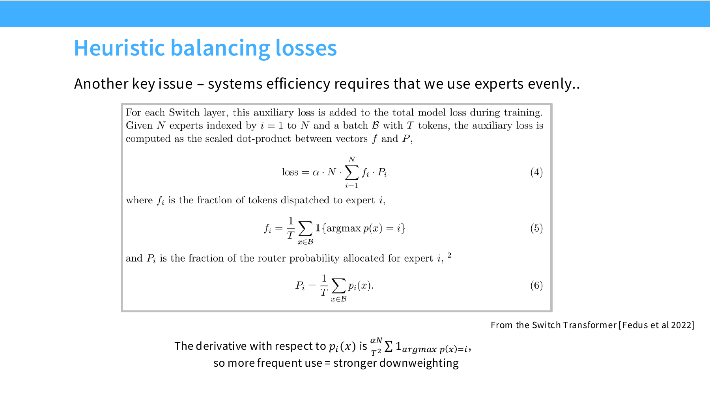

最值得记住的不是具体公式，而是优化逻辑：

- 用 auxiliary loss 把 router 往“更均匀”方向推

### 7.3 per-expert balancing vs per-device balancing

lecture4 还指出一个很实用的升级：

- 不只是看 expert 是否均衡
- 还要看设备级别是否均衡

因为在真实系统里，最终 bottleneck 往往不是抽象 expert，而是：

- 哪台设备收到多少 token
- 通信是否均衡
- 某个节点会不会被打爆

所以 DeepSeek 等设计里会出现：

- per-expert balancing
- per-device balancing

两类目标并存。

### 7.4 DeepSeek v3 的“auxiliary-loss-free” 变体

lecture4 里提到一个很有代表性的变体：

- 给每个 expert 设一个 bias
- 用在线更新方式调节这些 bias

直觉上，这相当于：

- 如果某个 expert 最近吃到的 token 太少，就提高它的偏置
- 让它更容易被选中

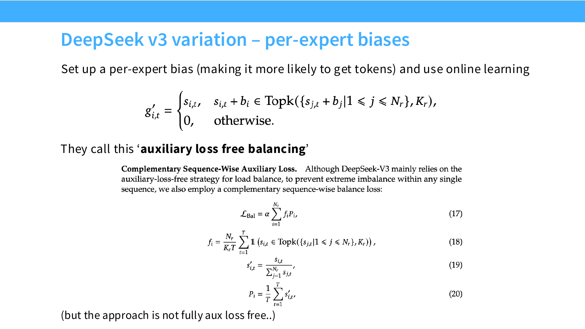

讲义也提醒了一个很好的工程态度：

> 它被称为“auxiliary loss free balancing”，但并不是真的完全没有 auxiliary 成分。

这说明你在看论文命名时要保持警惕：

- 名字可能强调某个方向
- 但具体实现未必完全摆脱该类思想

### 7.5 移除 balancing loss 会怎样

lecture4 专门放了一页问：

> 去掉 load balancing loss 会发生什么？

虽然 slide 这里更偏经验展示，但核心结论很明确：

- 不做 balancing 往往会显著恶化训练或系统效率

这是因为 MoE 最大的风险之一就是路由坍缩：

- 一些 expert 被疯狂偏好
- 一些 expert 基本不学东西

### 7.6 router 的数值稳定性

MoE 的另一个独特稳定性问题在 router 上。

讲义给出的经验解法是：

- router 单独使用 float32
- 有时再加一个 z-loss

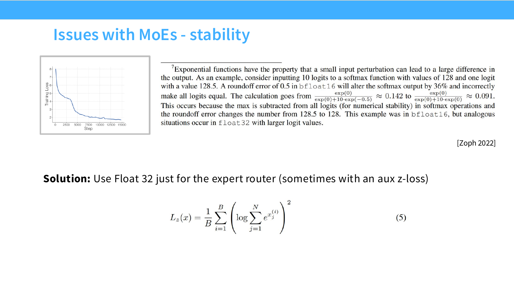

这很值得注意，因为它说明：

- 即使主干模型大量使用低精度
- 某些极小但关键的组件仍值得保留更高精度

### 7.7 z-loss 的角色

router z-loss 的角色与 lecture3 里 softmax 稳定性讨论是一脉相承的：

- 控制 logits 尺度
- 降低数值爆炸
- 让路由 softmax 更稳

这再次体现：

- MoE 的难点并不只是架构
- 还包括“如何让 router 的数值行为足够好”

### 7.8 微调阶段的额外风险

lecture4 还提到：

- sparse MoE 在较小微调数据上更容易过拟合

这是一个很实际的问题，因为 MoE 的容量巨大，而微调数据往往远少于预训练数据。

一些对应策略包括：

- 只微调非 MoE MLP
- 使用更多监督数据

这意味着：

- 预训练好的 MoE，不代表下游微调就天然更轻松

---

## 8. 系统与基础设施视角下的 MoE

如果只从论文公式看 MoE，很容易误以为它只是“多了一个 router”。  
但 lecture4 很强调另一件事：

> MoE 的真正难点往往在系统侧。

### 8.1 为什么说它“好并行”

MoE 的一大优点是：

- 每个 expert 可以放在不同设备上

从参数扩展角度看，这非常有吸引力，因为：

- 不需要每张卡都容纳全部 expert 参数
- 你可以把总容量分散到更多设备

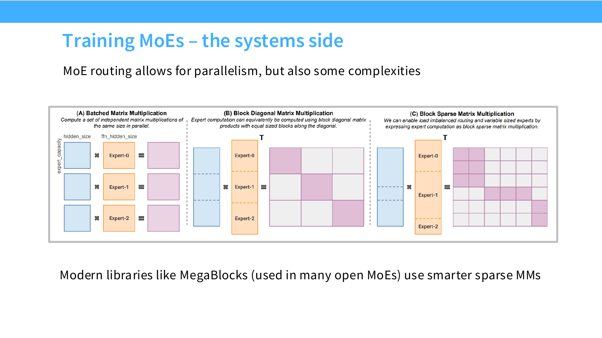

### 8.2 为什么它又“更复杂”

并行友好并不等于实现简单。  
因为一旦 token 被分发到不同 expert，就会引出很多系统问题：

- token 如何重排
- expert 间负载是否均衡
- 跨设备通信如何做
- all-to-all 代价多大
- 稀疏矩阵乘法如何高效实现

所以真正的 MoE 系统往往需要：

- 更复杂的 dispatch / combine 逻辑
- 更成熟的 sparse MM 内核
- 更精细的通信调度

### 8.3 为什么现代库开始变得关键

lecture4 提到如 MegaBlocks 这样的库，是因为：

- 没有高质量稀疏矩阵乘法实现
- MoE 的很多理论优势会在工程上被吃掉

这再一次说明：

- MoE 强不强，部分取决于架构
- 但很大程度也取决于系统栈有没有跟上

### 8.4 token dropping 与 batch-level stochasticity

lecture4 还提到一个有趣但很实际的问题：

- MoE 的随机性可能来自 batch 级路由

如果路由阶段存在：

- capacity limit
- token dropping

那么某个 token 是否真的能进入目标 expert，不只取决于它自己，也取决于同 batch 里其他 token。

这意味着：

- 其他人的请求有时会影响你的 token 是否被丢掉

这正是 “MoE stochasticity” 比 dense 模型更强的一部分来源。

### 8.5 为什么 MoE 的系统目标和模型目标绑得很紧

dense 模型里，系统优化和模型学习常常相对可分。  
而在 MoE 里，二者会深度耦合，因为：

- 路由方式直接决定计算图
- 负载均衡直接决定吞吐
- 容量限制直接改变训练数据实际流向

所以 MoE 里很多“训练技巧”其实同时是：

- 优化技巧
- 系统技巧

---

## 9. 近期代表性设计：Switch、Mixtral、Qwen、DeepSeek、OlMoE

这一节不是做论文综述，而是把 lecture4 里的代表性模型压成几个设计趋势。

### 9.1 Switch Transformer：最经典的稀疏路由 baseline

Switch Transformer 的标志性设定是：

- top-1 routing
- 强调简单高效
- 配套 load balancing loss

它的重要性在于：

- 它把“简单稀疏路由也能 work”这件事做成了一个强基线

### 9.2 Mixtral / DBRX：更典型的现代 top-k sparse MoE

这些模型代表了一种更常见的现代做法：

- top-k routing
- active experts 小
- routed experts 不算太少

它们体现的思路是：

- 不必极端到 top-1
- 适度多 expert 激活可能在表达与稳定性间更平衡

### 9.3 Qwen / DeepSeek：shared experts 与 fine-grained experts 的系统探索

Qwen 与 DeepSeek 系列很有代表性，因为它们不仅在做“经典 top-k”，还在探索：

- 更细粒度的 routed experts
- 少量总是开启的 shared experts
- 更复杂的 balancing 机制

这些设计常常体现一种工程判断：

- 完全纯 sparse 路由不一定是最稳的
- 给模型留一条共享基础通路，可能更有利

### 9.4 OlMoE：shared experts 未必总有用

lecture4 很好的地方在于，它没有把 shared experts 神化。  
OlMoE 的 ablation 给出的信息是：

- fine-grained experts 有收益
- shared experts 不一定有收益

这说明：

- shared experts 是一种合理设计
- 但并不是无条件默认最优

### 9.5 DeepSeek v1 -> v2 -> v3：一条非常典型的演化路线

lecture4 结尾专门用几页讲 DeepSeek v1/v2/v3，很适合当作一个案例研究。

#### DeepSeek v1

- shared + fine-grained experts
- 标准 top-k routing
- 标准 aux-loss balancing

#### DeepSeek v2

- expert 数量进一步扩大
- 引入 top-M device routing
- 加入 communication balancing

#### DeepSeek v3

- 更大的 routed expert 总数
- active experts 仍控制在较小范围
- sigmoid + softmax top-k + top-M
- aux-loss-free / seq-wise aux 风格的 balancing

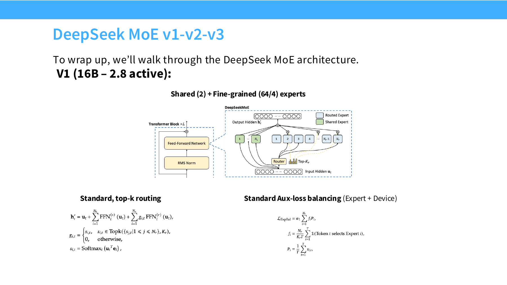

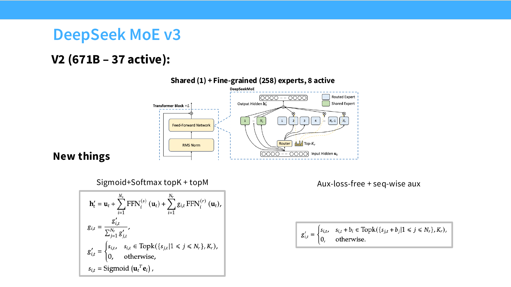

这条演化路线告诉你：

> 一个成熟的 MoE 设计，不只是“把 expert 数量加大”，而是 routing、balancing、device-level communication、shared expert 设计一起进化。

### 9.6 DeepSeek v3 还不只是 MoE

lecture4 还额外提到：

- MLA（Multi-head Latent Attention）
- MTP（多步预测）

这其实在提醒你：

- 强大的现实模型通常不是靠单一技巧取胜
- MoE 只是其中一个关键部件

也就是说：

- 一个成功的工业级大模型通常是“多种架构和系统优化的叠加”

---

## 10. 如果今天自己做一个 MoE，该默认怎么想

这一节把 lecture4 的经验压缩成一套“现代默认直觉”。

### 10.1 先回答：你为什么要用 MoE

如果你的目标是：

- 在相近 FLOPs 下扩大总参数容量
- 利用更多设备扩展模型容量
- 做更强的大模型预训练

那么 MoE 很值得考虑。

如果你的目标是：

- 快速实现
- 极简训练栈
- 小规模单机实验

那么 dense 模型往往仍是更稳妥的默认起点。

### 10.2 默认替换位置

若没有特别强理由，优先：

- 在 FFN/MLP 位置做 MoE

而不是先在 attention 上做 MoE。

### 10.3 默认 routing

若没有非常新颖的研究目标，默认从：

- token-choice top-k routing

开始。

这是目前最强的工程默认项。

### 10.4 默认 balancing 思路

不要幻想“不做 balancing 也行”。  
一个更现实的默认配置是：

- 至少有某种 per-expert balancing
- 如系统规模较大，再加入 per-device balancing
- router 用 float32
- 必要时加 z-loss 或其他 logit 稳定措施

### 10.5 shared experts 要不要加

保守建议是：

- 可以把它当成值得实验的选项
- 但不要把它视为铁律

因为现有经验并不完全一致。

### 10.6 真正的默认心智模型

如果用一句话总结 MoE 的默认工程心智模型：

> 先把 MoE 看成“稀疏化 FFN + top-k router + balancing + 通信调度”的联合系统，而不是一个只需要加 router 的小改动。

---

## 11. 高频考点与常见误区

### 11.1 高频结论

- MoE 最常见的做法是替换 Transformer block 中的 FFN
- MoE 的价值来自稀疏激活，不是简单参数堆叠
- “参数量更大但 FLOPs 相近”是 MoE 的核心卖点
- 现代 MoE 几乎都使用 token-choice top-k routing
- load balancing 是 MoE 训练和系统效率的关键
- router 往往需要特殊数值稳定性处理
- MoE 的优势与系统基础设施强相关
- shared experts 是重要但并未完全定论的设计点

### 11.2 常见误区

#### 误区 1：MoE 就是“更大的模型”

不对。  
MoE 的核心不是“大”，而是“总容量更大，但每个 token 只走其中一部分”。

#### 误区 2：参数不变 FLOPs 不变就说明实现也简单

不对。  
系统复杂度、通信和稀疏矩阵乘法，往往才是 MoE 的真正难点。

#### 误区 3：routing 只是一个小模块

不对。  
routing 决定了：

- 哪些参数被激活
- 负载是否均衡
- 通信如何发生
- 训练是否稳定

#### 误区 4：只要 top-k 能跑起来就行

不对。  
不做 balancing，或者 router 数值不稳，MoE 很容易退化。

#### 误区 5：MoE 一定优于 dense

不对。  
它常常在大规模训练和多设备环境下更有吸引力，但并不是任何场景下都更划算。

---

## 12. 附：最小 MoE 代码骨架

这部分不给完整工业实现，只给 lecture4 最相关的核心骨架。

### 12.1 一个最小 router

```python
import torch
from torch import nn


class TopKRouter(nn.Module):
    def __init__(self, d_model: int, num_experts: int, k: int):
        super().__init__()
        self.k = k
        self.proj = nn.Linear(d_model, num_experts, bias=False)

    def forward(self, x: torch.Tensor):
        # x: [tokens, d_model]
        scores = self.proj(x)
        topk_scores, topk_idx = torch.topk(scores, k=self.k, dim=-1)
        topk_weight = torch.softmax(topk_scores, dim=-1)
        return topk_idx, topk_weight
```

### 12.2 一个最小 expert

```python
class ExpertFFN(nn.Module):
    def __init__(self, d_model: int, d_ff: int):
        super().__init__()
        self.w1 = nn.Linear(d_model, d_ff, bias=False)
        self.w2 = nn.Linear(d_ff, d_model, bias=False)

    def forward(self, x: torch.Tensor) -> torch.Tensor:
        return self.w2(torch.relu(self.w1(x)))
```

### 12.3 一个最小 MoE 前向

```python
class SimpleMoE(nn.Module):
    def __init__(self, d_model: int, d_ff: int, num_experts: int, k: int):
        super().__init__()
        self.router = TopKRouter(d_model, num_experts, k)
        self.experts = nn.ModuleList(
            [ExpertFFN(d_model, d_ff) for _ in range(num_experts)]
        )

    def forward(self, x: torch.Tensor) -> torch.Tensor:
        # 教学版：不做高效 dispatch，只表达计算逻辑
        topk_idx, topk_weight = self.router(x)
        out = torch.zeros_like(x)

        for token_i in range(x.size(0)):
            token_out = 0.0
            for j in range(topk_idx.size(1)):
                e = topk_idx[token_i, j].item()
                w = topk_weight[token_i, j]
                token_out = token_out + w * self.experts[e](x[token_i:token_i+1]).squeeze(0)
            out[token_i] = token_out
        return out
```

这个版本当然不高效，但很适合理解 MoE 的前向本质：

- router 决定去哪些 expert
- expert 各自算 FFN
- 输出按 gate 权重加权回来

### 12.4 一个 lecture4 风格的现代默认配置

```python
moe_defaults = {
    "replace_where": "FFN only",
    "routing": "token-choice top-k",
    "active_experts": "small k",
    "balancing": "per-expert + maybe per-device",
    "router_precision": "fp32",
    "shared_experts": "worth trying, not guaranteed best",
    "systems_priority": "dispatch + communication + sparse MM matter a lot",
}
```

---

## 13. 一句话总结构图

如果只用一句话概括 lecture4：

> MoE 的本质，是用稀疏路由把“更大的总参数容量”和“较低的单 token 计算量”同时装进 Transformer 里，但你必须为此付出 routing、load balancing、稳定性与系统复杂度上的额外代价。

